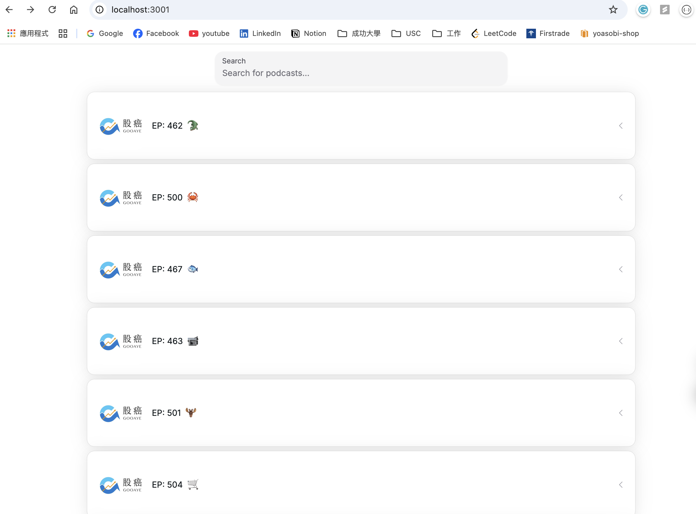
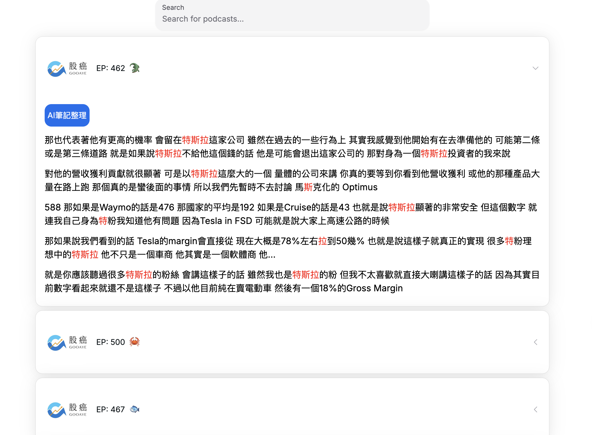
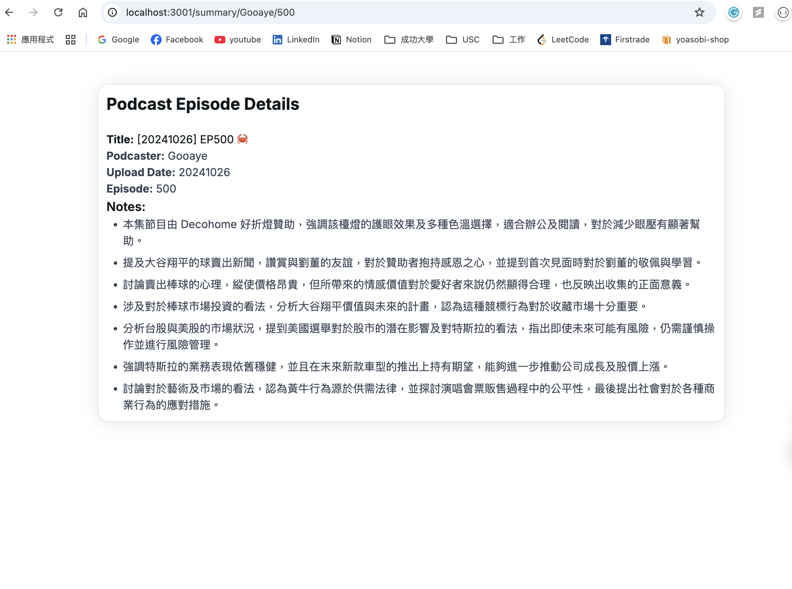

# Podcast Content Search

## Project Description

This is a website that can search content for podcaster: 股癌 Gooaye

Please check this demo video: https://youtu.be/3HPLH4eA1c4

This project is still ongoing ...

I utilized OpenAI speech-to-text api to tranform podcast to word, and used Elasticsearch as my vectored DB.

For now, it only have ten episodes.

### Demo screenshot

Initial Web Page

Expand one seach result

Click AI summary button


## Local Developement

### Sourve python env

```bash
source openai-env/bin/activate
```

### Go to /local-dev/podcast-downloader

run

```bash
python -m podcast_downloader --config config.json
```

1. Run main.py to generate text from podcast(audio)
2. Run merge-data.py to have valid json
3. Run init-es to put /merge-data into elasticsearch
4. Run generate-summary.py to generate summary from OpenAI and store in MongoDB
5. Run store_notes.py to store all the json in merge-data into mongoDB

## Frontend

- Next.js

## Backend

- Express

## OnGoing

Planning to deploy to GCP
